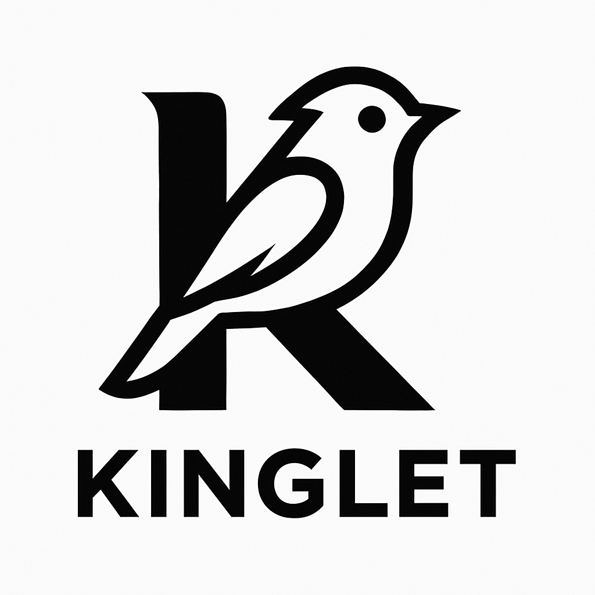

<div align="center">
  
  <h1>Kinglet</h1>
  <p><strong>A lightweight routing framework for Python Workers</strong></p>
</div>

Kinglet is designed specifically for Cloudflare Workers Python runtime, providing a clean, FastAPI-inspired API without the heavy dependencies. Perfect for building APIs that need to stay within Workers' startup and memory limits.

## Why Kinglet?

- **Lightweight**: Zero external dependencies, built for Workers
- **Clean Routing**: Intuitive decorators and path parameters  
- **Fast Startup**: No heavy framework overhead
- **Middleware Support**: Composable request/response processing
- **Type Hints**: Full typing support for better DX
- **Well Tested**: Comprehensive test suite

## Quick Start

```python
from kinglet import Kinglet

app = Kinglet()

@app.get("/")
async def hello(request):
    return {"message": "Hello, World!"}

@app.get("/users/{id}")
async def get_user(request):
    user_id = request.path_param("id")
    return {"user_id": user_id}

# Workers entry point
async def on_fetch(request, env):
    return await app(request, env)
```

## Features

### Routing

```python
# HTTP method decorators
@app.get("/users")
@app.post("/users")
@app.put("/users/{id}")
@app.delete("/users/{id}")

# Path parameters with type hints
@app.get("/users/{id:int}/posts/{slug:str}")
async def get_post(request):
    user_id = request.path_param("id")
    slug = request.path_param("slug")
    return {"user_id": user_id, "slug": slug}
```

### Request Handling

```python
@app.post("/api/data")
async def handle_data(request):
    # Query parameters
    page = request.query("page", 1)
    
    # Headers
    auth = request.header("authorization")
    
    # JSON body
    data = await request.json()
    
    return {"received": data}
```

### Response Types

```python
from kinglet import Response

@app.get("/json")
async def json_endpoint(request):
    return {"key": "value"}  # Auto-detected as JSON

@app.get("/custom")
async def custom_response(request):
    return (Response({"success": True})
            .header("X-Custom", "value")
            .cors(origin="https://mysite.com"))
```

### Middleware

```python
from kinglet import CorsMiddleware, TimingMiddleware

# Built-in middleware
app.middleware_stack.extend([
    CorsMiddleware(),
    TimingMiddleware()
])
```

### Sub-routers

```python
from kinglet import Router

api_router = Router()

@api_router.get("/users")
async def list_users(request):
    return {"users": []}

# Mount the router
app.include_router("/api/v1", api_router)
```

## Installation

```bash
pip install kinglet
```

## Workers Integration

```python
# worker.py
from kinglet import Kinglet

app = Kinglet()

@app.get("/")
async def hello(request):
    return {"message": "Hello from Kinglet!"}

async def on_fetch(request, env):
    return await app(request, env)
```

Deploy with Wrangler:

```toml
# wrangler.toml
name = "my-kinglet-api"
main = "worker.py"
compatibility_date = "2024-01-01"
compatibility_flags = ["python_workers"]
```

## Development

```bash
# Install development dependencies
pip install -e ".[dev]"

# Run tests
pytest

# Format code
black .
```

## License

MIT License - see LICENSE file for details.